# Removing the Human from the Loop, Not the Humans from the Project: End-to-End Automatic Fish Measurement for Citizen-Science Divers

*Working draft, 2026-09-29. Target: CSCW 2027. Companion papers: [P1] FishSense Lite system
characterization (IMWUT) and [P4] in-air calibration of a flat-port underwater camera (WUWNet).
Bracketed `TODO` items are for the authors. Every number here traces to `p2-results.md` or
`p2-tests.md`; the evidence map at the end gives the file for each claim.*

---

## Abstract

FishSense Lite measures fish with a consumer dive camera and a single laser pointer, at a
fraction of the cost of stereo systems. Its one outside deployment partner, the Reef
Environmental Education Foundation (REEF), stopped using it because its data could not be
processed quickly, and moved to a machined dual-laser caliper that needs no calibration. We
treat that loss as a design finding. Measured stage by stage, today's automated pipeline
costs minutes of machine time per dive; the cost that remains is people's: about 41 seconds
of labelling for every measured frame and about a minute for every slate frame used for
calibration. The system asked too much of people at two points: a per-dive calibration and a
chain of human labels (laser dot, snout, fork, species).

We make both steps automatic, using only commodity hardware and still images.

- **Calibration:** we tested every commodity cue for recovering the laser's angle from dive
  images alone (dot size, brightness, beam scatter, defocus, flat-port refraction). All fail
  at full laser power, for reasons we identify. What does work is *size constancy* [P4-laser]:
  any rigid object shot near and far with the dot on it fixes the angle, with no known size and
  no printed template. We add a variant that needs no human labels either. On 10 pool calibration sessions it matches the known-size
  slate calibration within 0.05° on 9 (median 0.02°). It costs 0.4 percentage points of
  length error against tape-measured models.
- **Labels:** we chain the production laser detector, a SAM 3.1 fish mask, a geometric
  head/tail keypointer and a BioCLIP species head.
- **End to end:** on 791 frames of real reef fish, the fully automatic length is unbiased
  against the manual pipeline (median +0.3%, mean absolute error 5.4%, 82% within 10%). It
  produces a length for 72% of the frames humans measured and for about 80% of individual
  fish. It declines 84% of the frames humans rejected as unmeasurable.

We also report where the remaining errors come from and why several intuitive fixes do not
help, and we discuss what automation changes about the division of labour in citizen-science
measurement.

---

## 1 Introduction

Fish length is the basic unit of fisheries science. Length-frequency distributions drive
stock assessments, spawning-aggregation monitoring and marine-protected-area evaluation.
Divers are well placed to collect these lengths, but the tools that measure accurately
underwater (stereo-video rigs, calibrated laser calipers) are expensive, bulky or
custom-made. FishSense Lite [P1] instead pairs a consumer waterproof camera (Olympus TG-6/TG-7)
with a single green or red laser pointer in a 3D-printed or aluminium mount. The laser dot
gives the range to the fish, and the range turns the fish's image length into metres.

Cheap hardware only makes the system usable if the rest of the workflow is cheap too.
REEF used FishSense Lite for over a year and then stopped. Their data could not be turned
into lengths quickly. Calendar delay is a poor measure of the system, though: dives waited a
median of 227 days just to reach the lab, and the processing pipeline was run by hand from
notebooks until it moved onto a workflow engine. Measured stage by stage (§3.1), today's
automated pipeline takes about a quarter of an hour of machine time per dive. What remains is
human effort: about **41 seconds of labelling per measured frame** (laser dot, snout and fork,
species) and about **a minute per slate frame** for each dive's calibration. REEF moved to a custom dual-laser caliper on a GoPro, and among their reasons they cited the
per-dive calibration. A caliper needs no calibration because its geometry is fixed when it
is manufactured. It trades the accessibility of fabrication for zero calibration effort.

This paper takes the other route. It keeps the accessible hardware and removes the human
effort. The logic is the same as our companion work [P4], which replaced a printed-checkerboard
lens calibration with LEGO bricks: every step that needs expertise, special equipment or
patient manual labour is a step at which a volunteer programme can stall. We address the
two steps that remain after [P4]:

1. **The per-dive laser calibration.** Today a diver photographs a duct-tape dive slate, and
   a person marks its corners and the laser dot in each photograph.
2. **The human labels.** For every measured frame, people mark the laser dot, the fish's
   snout and fork, and its species.

**Contributions.**

- **C1, the cost of friction, measured.** We separate REEF's delay into waiting for data,
  machine time and human effort, measuring each from data transfer dates, workflow-engine
  history and per-label timing, and quantify how pre-annotation anchors human labellers: 87% of
  pre-filled dots are accepted unchanged. This recasts "human agreement" figures as acceptance rates
  (§3).
- **C2, a map of commodity calibration cues.** We test every depth cue available to a single
  full-power laser and a consumer camera without extra hardware, and explain why each fails.
  We then adopt size constancy [P4-laser], make it label-free, and measure its end-to-end cost
  (§4).
- **C3, an end-to-end automatic pipeline.** It runs from the laser dot to fish length and
  species with no human input. We evaluate it against tape-measured models in a pool and
  against the manual pipeline on real reef fish, stage by stage, so each component's cost
  is visible (§5–6).
- **C4, design implications** for citizen-science measurement: which human steps automation
  removes, which it cannot, and what volunteers are asked to do instead (§7).

`TODO(authors)`: confirm REEF's reasons in their own words (§3 currently rests on the
project lead's account) and decide whether REEF is named.

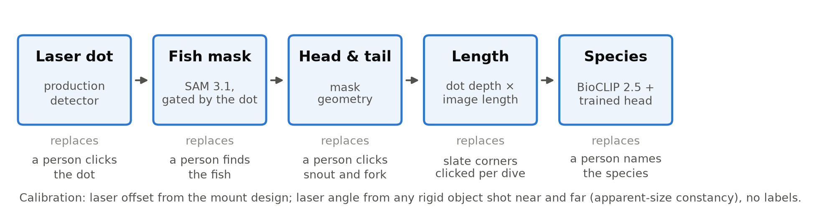

*Figure 1. The automatic pipeline. Each stage is the production component, chained with no human input; the second line under each says which human step it replaces.*

---

## 2 Background and related work

`TODO(authors)`: full related-work pass. Planned structure:

- **Underwater length measurement.** Stereo-video (EventMeasure and similar), parallel-laser
  calipers, single-laser photogrammetry. [P1] Table 1 prices calipers at about 12% error and
  $600, against FishSense Lite at 15% and $1,040.
- **Citizen-science data pipelines.** Volunteer labelling (Zooniverse and similar),
  latency between collection and use, volunteer retention, and quality control through
  redundancy versus expertise.
- **Human–AI labelling.** Pre-annotation and automation bias. Our anchoring result (§3.2)
  is an observational instance.
- **Camera calibration without targets.** Self-calibration, structure from motion,
  depth-from-defocus and flat-port refraction models; [P4] for the lens.
- **Foundation models for ecology.** SAM-family segmentation prompted by text, and BioCLIP
  for species identification. The class project we build on for species ID [CG] is a
  UCSD CSE 237D project (Coral Gardeners / National Geographic, 2026).

---

## 3 Where the friction is

### 3.1 Where the time goes

Calendar time from dive to measurement mixes three different things: waiting for data to
arrive, the pipeline's machine time, and people's labelling. It also mixes eras. The pipeline
was run by hand from notebooks before it moved onto a workflow engine, and processing was not
always anyone's focus. We therefore measure each part separately (Table 1).

**Table 1. Where the time goes, by stage.**

| stage | owner | measured from | median (p90) |
|---|---|---|---|
| waiting for data | organisation | REEF data-transfer date − capture time, 242 dives | 227 days |
| intake | system | workflow-engine runs, 53 dives | 39 s (1.3 min) |
| preprocessing (laser, head/tail, species) | system | workflow-engine runs | 5.4, 2.3, 3.1 min (up to 38 min) |
| head/tail prediction | system | workflow-engine runs | 2.8 min (36 min) |
| calibration, depths, measurement | system | workflow-engine runs | 4 s, 3 s, 10 s |
| review | system, automated | laser-line validator, 164,873 runs | 1.7 s (3.7 s) |
| labelling | **people** | Label Studio time per label, drawn without a pre-fill | dot 13 s, snout + fork 15 s, species 12 s; slate 61 s per frame |

Machine time is about a quarter of an hour per dive, and review is automated. The calendar
delay that REEF experienced was mostly waiting for data, which the system does not control.
What the system does control, and what this paper removes, is the human labelling: about 41 s
for every measured frame plus about a minute for every slate frame (Figure 8). Workflow-engine
history is retained for about 30 days, so the machine times describe the current pipeline
(September 2026), not the 2023–24 notebook era.

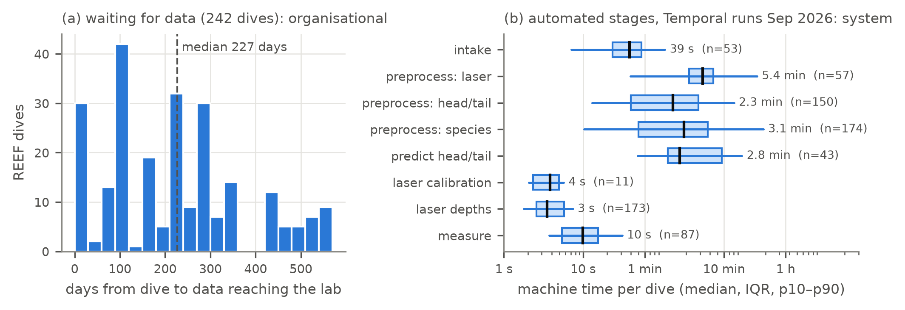

*Figure 2. (a) Days a REEF dive's data waited before reaching the lab, an organisational delay.
(b) Machine time per dive for each automated stage, from completed workflow-engine runs
(September 2026). The laser-line review, median 1.7 s, is omitted.*

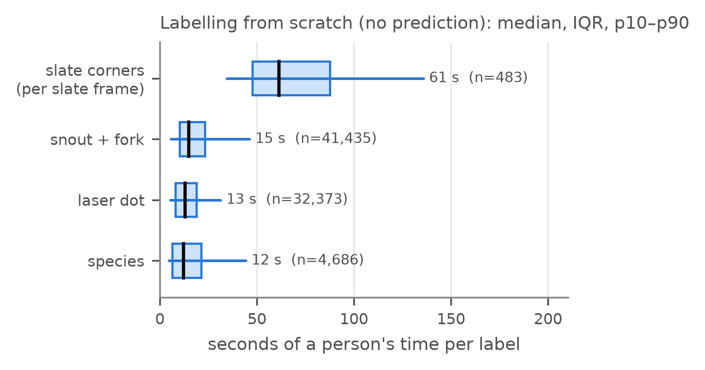

*Figure 8. Person-time per label, for annotations drawn from scratch (no prediction or earlier
label as a seed). A measured frame needs a laser dot, snout + fork and species (about 41 s at
the medians); each dive also needs its slate frames' corners (61 s per frame).*

### 3.2 Human labels are anchored, so "agreement" is acceptance

Production records 755 images labelled twice. Examined closely, they are not independent
opinions:

- 751 pairs span two labelling campaigns a median of about 260 days apart.
- The later campaign was pre-filled with the earlier human label.
- Of 711 pairs that had a pre-fill:
  - **626 (87%) accepted it unchanged;**
  - most of the rest moved it by under a pixel.
- Pre-fills since superseded by the validator were still accepted 77% of the time, against
  94% for pre-fills still current.
- 184 images now hold only accepted copies of a superseded label.

Two consequences. First, figures such as "93% byte-exact agreement" with a detector measure
acceptance in this interface, not accuracy. Second, detectors must be scored against labels
drawn *without* a pre-fill, which is how we score them below.

### 3.3 What divers delivered

Even when labelled, the field data fall short of what the length estimator was designed for
[P1]:

- a median of 2 frames per animal, with 42% of animals photographed only once;
- 22% of measured frames taken inside 1 m;
- only 27% taken inside the 2–5 m range [P1] advertises.

These are shortfalls against requirements nobody communicated to divers, not failures to
comply. They matter for §6: an automatic pipeline has fewer frames per fish to choose from
than the estimator assumes.

---

## 4 Removing the calibration cost

### 4.1 What has to be calibrated

The laser is fixed to the camera housing at a lateral offset |O| ≈ 104 mm. A dot at range Z
appears in the image at p = v + A/Z, where A = f·|O| and v is the laser's vanishing point
(where the dot would appear at infinite range).

- **v encodes the laser's tilt.** Tilt drifts with mount creep and knocks, particularly in
  3D-printed PLA mounts, which we intend for citizen builders.
- **The dots alone cannot reveal v** [P1]: every choice of v along the dot line produces a
  self-consistent dive. A second commodity laser does not remove this unless the angle
  between the lasers is calibrated.
- **The target is tight.** Length accuracy needs v to within about 2.5 px (0.05°).

Today v comes from photographs of a duct-tape dive slate of known size, whose corners a
person marks. The slate is deliberately approachable: volunteers make it from tape and a
standard slate. We keep that approachability as a constraint and rule out printed or
fabricated targets, which would reintroduce what [P4] removed. We also rule out dimming the
laser: an ND filter would cost range that field work needs.

### 4.2 Cues that fail, and why

We tested each depth cue available from a single full-power laser and a consumer camera
(Table 2). Each failure has a physical cause, which is why we report them: they bound what
any future method can extract from this hardware.

**Table 2. Commodity depth cues for laser self-calibration.**

| cue | idea | result | why it fails |
|---|---|---|---|
| dot size | dot width s = c + b/Z pins v | **fails** all three pre-registered checks (residual 0.38 px vs 0.1 target) | 84% of dots are clipped; only 1.5–4.4 m dots are usable, too little spread in 1/Z |
| dot wings | fit the Gaussian profile of a clipped dot | **fails** (fitted peak 0.15–0.30 of full scale; width residual 4.5–36 px) | the wings are scattering halo, not the beam profile |
| dot light loss | brightness ∝ reflectance · e^(−2cZ)/Z² | **fails** (12–19% per-dot range error in the best case; 700 frames, 24 dives) | surface reflectance varies 2–8× between targets and 1.6–2× within one; absorption fits come out unphysical |
| autofocus | lens position encodes range | **fails** | hyperfocal distance 1.87 m, so the lens sits at infinity across the working range |
| defocus | blur ∝ 1/Z | too weak | ~1–6 px blur at 1–5 m (1.34× stronger behind the flat port), but 0.02–0.07 px precision would be needed |
| flat-port refraction | the port makes the camera axial; image position depends weakly on depth | ruled out by calculation | 0.02–0.08 px at 1–3 m, 30–100× below what v needs |
| beam streak | scattered beam light forms a wedge whose apex is v | real but imprecise | present on 2 of 7 green dives (≈2% of full scale, 15–30× red); apex pinned to only 0.9–2.5° by width (divergence adds an unknown constant) or by brightness (absorption trades off against v) |
| second laser | dot separation gives range | does not remove the ambiguity | shared inverse-depth ambiguity unless the inter-laser angle is calibrated, and PLA creep moves it |

### 4.3 Size constancy: any rigid object, no known size

*Scope and credit.* The laser's geometry belongs to [P1], the analysis of the system: the dot
locus, the scale ambiguity along it, why a mount prior cannot close it, and the invariance of
the estimator to constant errors in the size measure. We cite it there and use only the
result. This paper covers the apparent-size calibration itself: the procedure, the size
measure, the label-free variant, and its evaluation. The method and its first evaluation were
developed in the flat-port work [P4-laser].

Its key results, from [P4-laser]:

- **End to end with no reference object in the water.** The camera is calibrated in air.
  The laser is calibrated only from the apparent size of a swinging fish decoy whose size is
  never used. The pipeline then measures a held-out 549 mm board at **+0.0% median**, with
  every frame within 5%. With no per-dive calibration it reads −5.4% median, and only 40% of
  frames are within 5%.
- **Absolute scale.** The decoy's own length reads back at 311.2 mm against 312.5 mm
  calipered (−0.4%).
- **Production corpus.** 2,927 frames over 32 dives reproduce the known-length calibration to
  0.003° on a slab target.
- **The design rule.** Size must be measured on the surface the dot lands on and must not
  drift with range. √(mask area) outperforms body length or height.

What this paper adds is a fully label-free variant, which needs no masks and no corner
labels, validated on 10 calibration sessions. It also measures the method's effect on
end-to-end length against tape (§6.1), and maps the alternatives that fail (Table 2).

What breaks the ambiguity is an object whose true length cannot change between frames. If
an object's apparent size is s_k in frame k, and the dot sits at t_k along the laser line,
then s_k ∝ 1/Z_k and t_k − v ∝ 1/Z_k. So

  **s_k / (t_k − v) is constant across frames only for the true v.**

The object's physical size cancels. Metric scale comes from |O|, which is fixed by the
mount's CAD model. The per-dive slate fit of |O| is noisier than the design value: ±1.5 mm
between dives on the same mount, plus one outright failure at 129.5 mm. The method needs the
object seen at a spread of ranges, at least about 1.5× in distance.

**Validation with human corner labels.** We treated the slate as an object of *unknown*
size, using only the relative spread of its 8 labelled points. On 10 sessions with a size
spread of 1.75–2.9×, the fitted angle matches the stored known-size calibration with a
median |Δ| of **0.016°**, a maximum of 0.060°, and **9 of 10 within 0.05°**. Four sessions
with under 1.12× spread are unconstrained, as the method predicts.

**Label-free.** We then removed the labels entirely:

1. SIFT features are extracted around the dot in each frame.
2. Every pair of frames is registered with a RANSAC similarity transform, giving a scale
   ratio.
3. The object is picked as the motion layer with the most matches within 80 px of the dot.
   The dot is on the object by construction, which rejects the static background and people
   moving through the scene.
4. Per-frame sizes come from a weighted least-squares solve over all pairs, dropping pairs
   inconsistent with the rest.

On the same 10 sessions this gives **9 of 10 within 0.05° and 10 of 10 within 0.15°**,
median error about 0.02° (Table 3). It needs no known size, no printed template, no scan of
the slate and no human labels.

**Table 3. Label-free calibration vs the stored known-size calibration.**

| session | frames | size spread | error | bootstrap SE |
|---|---|---|---|---|
| 62 | 20 | 1.75× | +0.033° | 0.049° |
| 63 | 12 | 2.15× | −0.002° | 0.071° |
| 65 | 27 | 2.92× | +0.025° | 0.013° |
| 71 | 32 | 2.90× | +0.009° | 0.020° |
| 77 | 22 | 2.46× | +0.009° | 0.020° |
| 80 | 31 | 2.72× | +0.007° | 0.023° |
| 83 | 26 | 2.21× | −0.038° | 0.028° |
| 87 (tilted slate) | 30 | 2.21× | −0.031° | 0.011° |
| 94 (tilted slate) | 21 | 2.06× | −0.044° | 0.018° |
| 114 (tilted slate) | 29 | 2.18× | −0.129° | 0.089° |

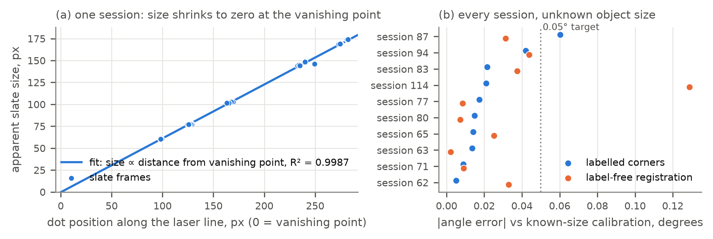

*Figure 3. Size constancy. (a) In one session the slate's apparent size is proportional to the dot's distance from the laser's vanishing point (R² = 0.999); the line reaches zero at x = 0. (b) Every session scored against tape: length error of the tape-measured fish models in the paired dive, with the human dot and head/tail held fixed so only the calibration differs. Production's known-size calibration and the unknown-size fit from the same corner labels both average 2.9%; the label-free fit averages 3.3%, or about 2.8% without session 114 (tilted slate, people moving through the scene).*

**Against tape.** Table 3 measures agreement, not accuracy. The stored calibration is built
from the same frames and, for the labelled variant, the same corner clicks; it also trusts the
slate to match its scanned template and the mount to be where it is assumed, so it inherits
their manufacturing tolerances. The independent test is measured length. Each session
calibrates a paired dive of fish models whose lengths were measured by tape or fish length board, and with the human dot and head/tail
held fixed only the calibration differs (Figure 3b): production's known-size calibration and
the unknown-size fit both average 2.9% per-fish error, and the label-free fit 3.3% (about 2.8%
without session 114). Pooled over 1,528 frames, switching from the slate calibration to the
label-free one moves per-fish error from 3.0% to 3.4% (production's p90 estimator; §6.1).

**What we did not do.** Fish themselves did not work as the rigid object in existing field
data: frames of the same fish are near-duplicates in range (median range ratio 1.01–1.06).
The method therefore needs a small protocol change: shoot *something* near and far with the
dot on it. It could be the diver's own slate of any design, a dive light or a rock. We have
not yet tested a non-slate object in the field.

**Measuring the apparent size.** The fit needs only each frame's slate size up to a constant, so
several measures work; they differ in what they need and in how they respond to tilt. Scored by
the length error of tape-measured fish models in each session's paired dive (Figure 10), a
SAM 3.1 mask of the slate found by a text prompt at the laser dot ("white board"; 253 of 258
frames), taking the square root of its area, averages 2.8% with no human input, against 2.9%
for production's known-size calibration. Image registration averages 3.3%, pulled up by a
session with a tilted slate and people moving through the scene (8.3%, where the mask gives
1.3%). On a deliberately tilted slate (session 94) every area-based measure does worse,
because tilt shrinks the area as well as range.

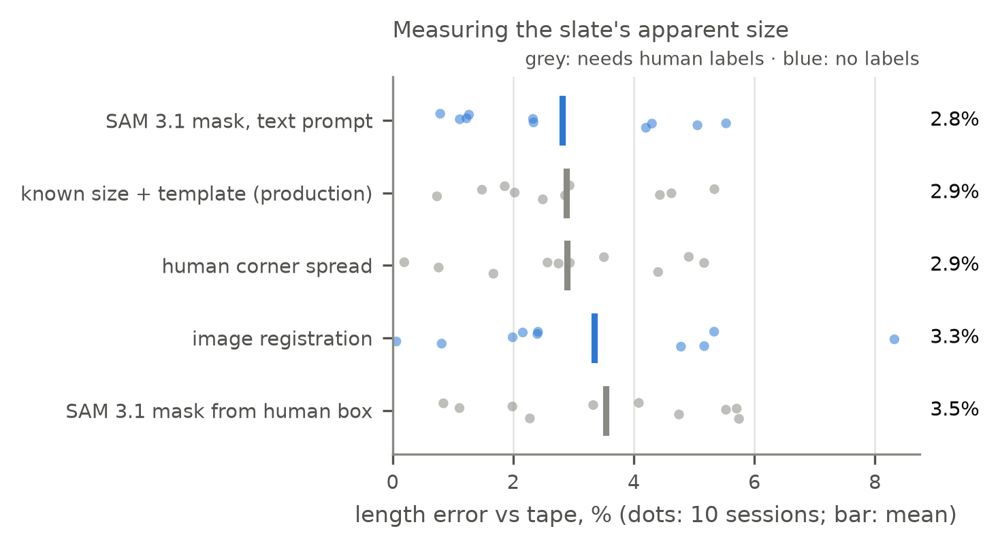

*Figure 10. Ways to measure the slate's apparent size, each scored by the length error of
tape-measured fish models in the paired dive (dots: the 10 calibration sessions; bar: mean).
Grey measures need human labels; blue ones do not.*

**Finding the calibration frames.** The label-free fit still needs to know which frames show
the slate. A slate-frame classifier (EfficientNet-B0 on the whole rectified frame) does this for
the duct-tape slates (H, Tic-Tac-Toe, V); checkerboards and the Box are negatives. After one
round of blind review labelling, in which the reviewer never saw the model's score, held-out-dive
cross-validation gives precision 99.9% and recall 99.4% over 6,775 frames, one false alarm, and at
least one slate frame found on 166 of 167 slate dives (Figure 9). These figures exclude a one-off
cutting-board test slate (53 frames) that is not a deployed duct-tape slate, and correct two pool
frames found on review to show a fish model rather than a slate. It detects duct-tape slates
only: another rigid object still calibrates, but its frames must be picked some other way.

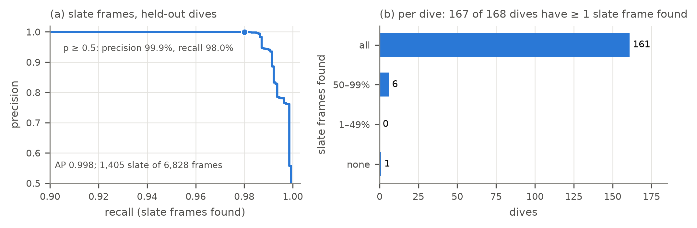

*Figure 9. Slate-frame detection, dive-grouped cross-validation. (a) Precision against recall
over 6,775 frames (excluding a one-off cutting-board test slate); the dot marks the p ≥ 0.5
operating point. (b) For each dive with slate
frames, the share of them found at p ≥ 0.5.*

**Lens intrinsics.** We use [P4]'s LEGO in-air calibration.

---

## 5 Replacing the human labels

Each stage below is the production component, evaluated on its own and then chained (§6).

### 5.1 Laser dot

On 1,571 frames across 249 dives, scored against dots drawn *without* a pre-fill (§3.2), the
production detector's recall is **0.821** [0.80, 0.84].

- **By colour:** 0.860 red, 0.752 green.
- **By setting:** the pool is harder than the reef.
- **Confidently wrong points:** 6.4% of dots, mostly a *different* bright spot.

Two inference-only fixes (passing the known laser colour, and restricting to the dive's
laser line) raise recall to about 0.84 and roughly halve wrong-spot measurements.

In the end-to-end runs below, the automatic dot lies a median of **0.8–0.9 px** from the
human dot (p90 2.1 px in the pool; 3.9 px red and 4.7 px green on the reef). Gross misses
(> 20 px) occur on 5.4% of green reef frames and 0.7% of red. As §6.3 shows, the downstream
fish-mask check absorbs these misses.

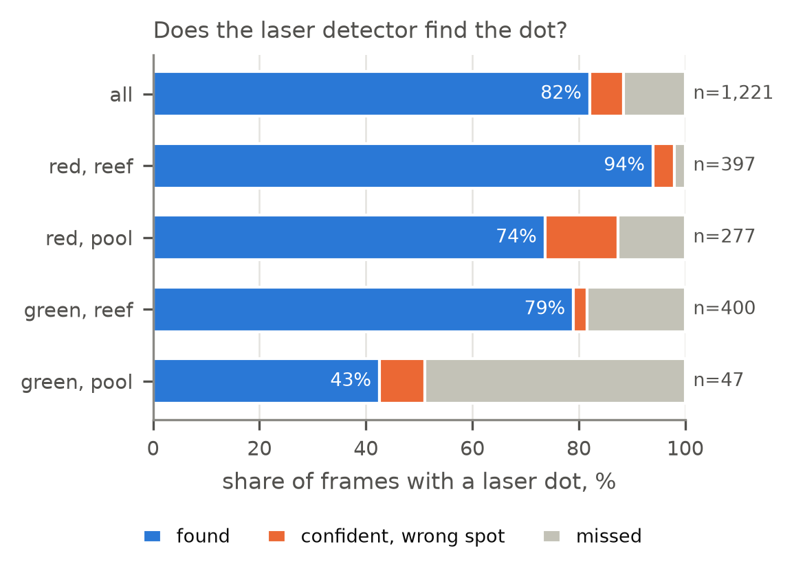

*Figure 11. Laser-dot detection against human dots drawn with no pre-fill (1,221 frames with a
dot, 226 dives): found within 10 px, a confident point on the wrong spot, or missed, by laser
colour and setting.*

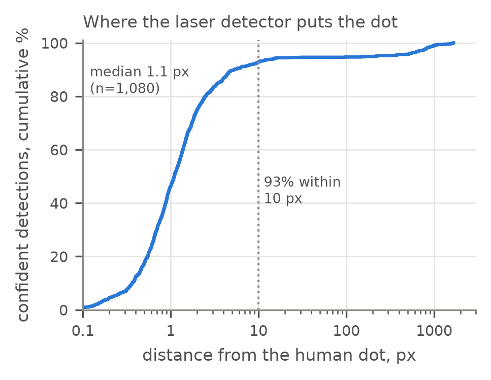

*Figure 12. Distance from the human dot for confident detections (cumulative, log scale): median
1.1 px, 93% within 10 px; the tail is mostly a different bright spot.*

### 5.2 Fish mask

The production head/tail stage segments an 1800×1350 crop around the dot with SAM 3.1, text
prompt "fish", keeping masks scoring above 0.5 [SAM3]. The dot acts as a gate: the chosen
fish is the mask containing the dot. §6.2 analyses coverage.

### 5.3 Head and tail

The keypointer takes the mask's principal axis, decides head from tail by peduncle and hull
shape, and returns the two ends.

- **Real reef fish:** it agrees with the human clicks on REEF target species (§6.2).
- **Pool models:** on fish models with long or lobed caudal fins (a shark with a heterocercal
  tail, an angelfish) it places the tail on a fin tip rather than the fork.
- **Fork finder:** a caudal-fork rule (deepest outline notch in the tail third) moved the tail
  little and did not reduce error, so we did not adopt it.

### 5.4 Species

We adapt BioCLIP 2.5 with the 13 REEF species of interest [CG; BioCLIP]. Truth is human
species labels on 482 real-fish frames (387 of target species, 95 "other").

- **Zero-shot** on the automatic mask crop reaches **66%** top-1. It confuses Black and
  Goliath Grouper, and several parrotfish with Midnight Parrotfish. Blacking out the
  background halves accuracy.
- **Trained head.** We fit a logistic-regression head on BioCLIP embeddings, with an explicit
  "other" class. Each dive is held out and predicted by a model trained on the other dives,
  and regularisation is chosen inside each training fold. Species the training dives barely
  cover keep their zero-shot score. This gives:
  - **77.6%** top-1 on target species (balanced 69.8%);
  - Hogfish 94%, Stoplight Parrotfish 86%;
  - recognition of 53% of non-target fish, which the closed-set classifier could not do at
    all.
- **Limit: labelled dives.** Black Grouper appears on only 2 dives and stays at 26%.

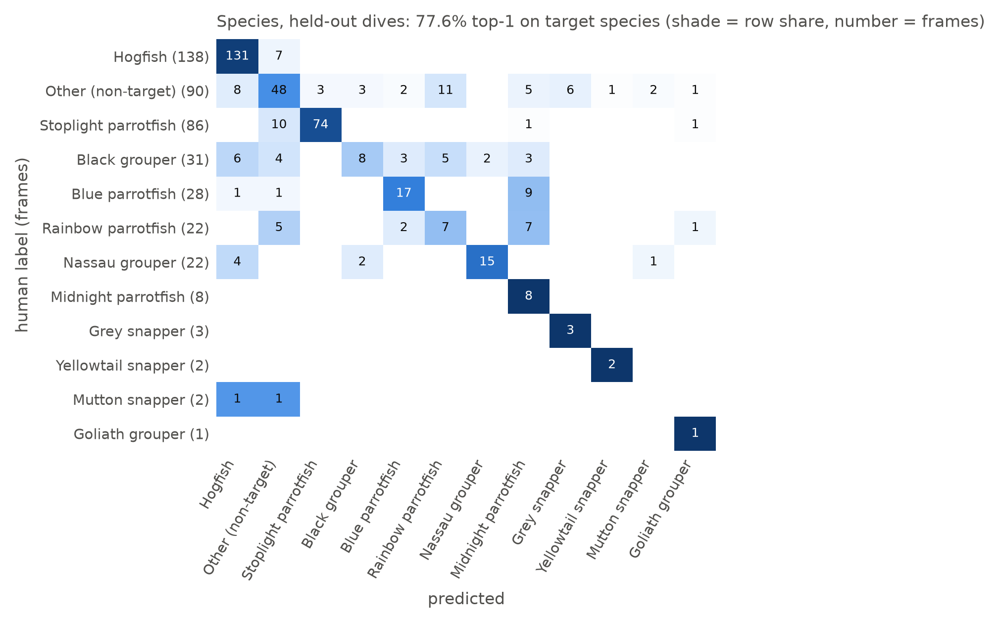

*Figure 7. Species confusion for the trained BioCLIP head on held-out dives (shade = share of the row, number = frames).*

---

## 6 End-to-end automatic measurement

### 6.1 Pool: tape-measured models

We chained all stages on 1,528 frames of rigid fish models and a ruler, over 10 pool dives
(Table 4). We replaced one human input at a time, so each stage's cost is visible.

**Table 4. Stage ladder (per-fish error of production's p90 estimator, mean absolute).**

| dot | head/tail | calibration | frames measured | per-fish error |
|---|---|---|---|---|
| human | human | slate | 100% | **3.0%** (production today) |
| auto | human | slate | 99.7% | 3.1% |
| human | human | label-free | 100% | 3.4% |
| human | auto | slate | 92% | 10.2% |
| auto | auto | slate | 91% | 10.1% |
| **auto** | **auto** | **label-free** | **91%** | **10.5%** |

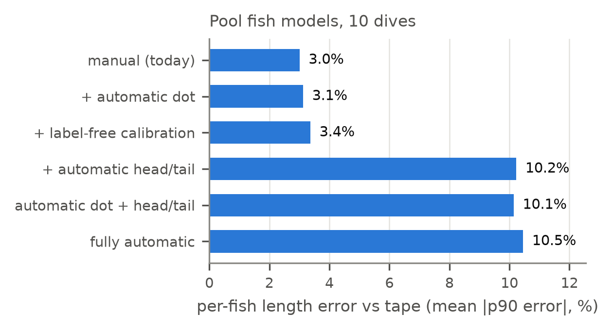

*Figure 4. Per-fish length error against tape as each human input is replaced. The dot and calibration cost 0.1 and 0.4 points; the head/tail stage carries the rest.*

The dot and the calibration are nearly free (+0.1 and +0.4 points). The pool's remaining
error is entirely the head/tail stage, and it is model-specific:

| model | fully automatic | manual |
|---|---|---|
| Grouper | 3.7% | 3.3% |
| Snook | 4.9% | 2.7% |
| Purple Angelfish | 9.4% | 2.9% |
| Shark | 27.9% | 3.2% |

The last two are the fin-tip placements of §5.3.

### 6.2 Reef: real fish

On 791 frames of real fish from 10 reef dives (7 green-laser, 3 red), there is no tape, so
we compare against the human pipeline.

**Head and tail**, from masks seeded at the human dot:

- head within 1.4% of length of the human click, tail within 7.5% (medians);
- pixel-length ratio automatic/human **median 1.005, MAE 5.9%**;
- head and tail swapped on 0.2%.

**Fully automatic length vs manual length**, on the 8 dives with a stored calibration:

- **median +0.3%, MAE 5.4%;**
- 62% within 5%, **82% within 10%**, 3.1% off by more than 20%.

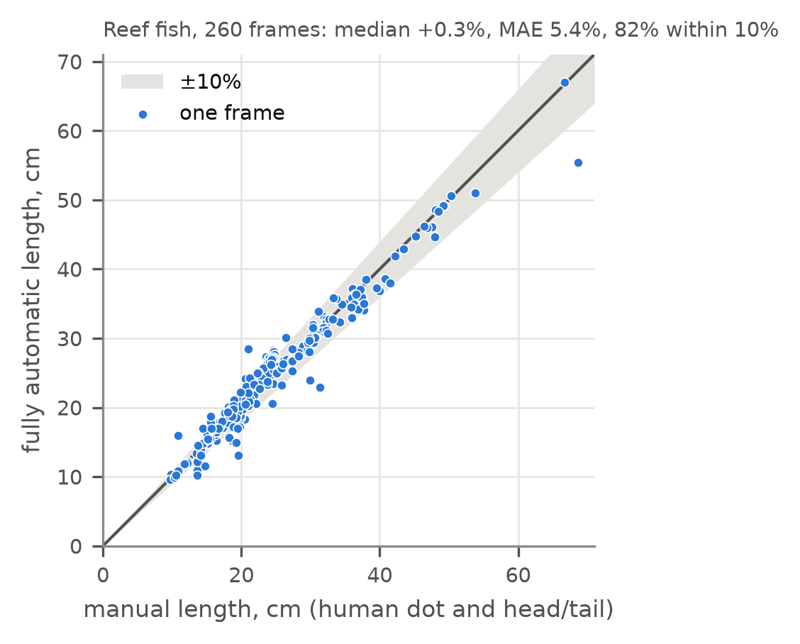

*Figure 5. Fully automatic against manual length on real reef fish (calibrated dives, same calibration). Shading marks ±10%.*

On REEF target species the automatic head/tail is therefore unbiased relative to humans.
The pool's large biases belong to model shapes REEF does not target.

**Coverage.** 37% of reef frames were rejected by human labellers as not measurable. The
pipeline agrees on 84% of them and produces no length. On frames humans *did* measure, the
pipeline covers **72%** (red 91%, green 66%). The misses are:

- small fish SAM does not detect (median 252 px long against 441 px for covered fish);
- fish detected below the 0.5 cutoff, mostly on green dives.

Per individual fish (same-fish clusters, median 2 frames each), **about 80% of fish receive
at least one automatic length**, and 72–74% receive one within 10% of the human's. The
clustered dives have above-average frame coverage, so this is optimistic.

### 6.3 Fixes that did not help, and why

- **Lowering the SAM cutoff** trades coverage for false measurements almost one for one:

  | cutoff | human-measured frames covered | human-rejected frames given a length |
  |---|---|---|
  | 0.5 | 72% | 16% |
  | 0.3 | 77% | 22% |
  | 0.2 | 80% | 25% |

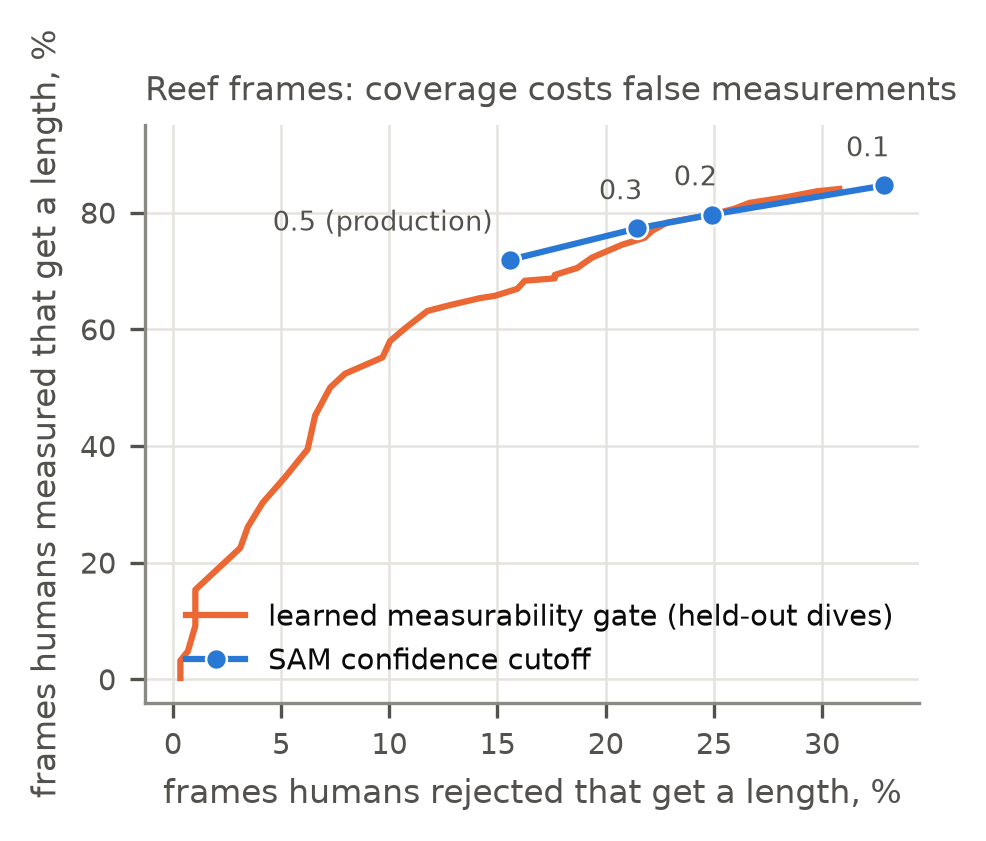

*Figure 6. Coverage against false measurement on reef frames. Lowering SAM's confidence cutoff (blue) trades one for the other; a learned measurability gate (orange, held-out dives) does no better.*

- **A learned measurability gate** on mask features (score, shape, solidity, dot position,
  prompt agreement) reaches AUC 0.73 against the human decision, almost all from SAM's own
  score. At production's false-measurement rate it covers *fewer* frames (67%) than the
  plain cutoff. SAM's confidence already is the best mask-level gate.
- **Gating the laser dot** by detector confidence, or by distance from the dive's laser line,
  catches up to 25 of 36 gross dot misses. It barely changes lengths: a misplaced dot rarely
  lands on a fish mask, so the dot-on-mask check already turns dot misses into abstentions.
- **Other prompts** ("reef fish", "a fish") and a tolerance for the dot just off the mask
  recover under 2 points.

---

## 7 Discussion

`TODO(authors)`: develop. Points to argue:

- **What automation removes, and what it does not.**
  - It removes the per-frame labour (dot, snout, fork, species) and the per-dive slate
    labelling.
  - It does not remove the diver's judgement about *what* to photograph. Coverage is bounded
    by fish size in frame and by angle and curvature, which humans already screen for.
  - The volunteer's job shifts from labelling to capture: several frames per fish, a spread
    of ranges, the dot on the fish, and one near-and-far shot of any rigid object per dive.
- **Latency is a social variable.** Most of REEF's delay was waiting for data to reach the lab
  and periods when processing was nobody's focus, not machine time. Human steps queue behind
  one another and behind availability; automating them changes who has to wait for whom.
- **Acceptance is not agreement.** Pre-annotation interfaces can make a model look accurate
  simply because people accept its suggestions. Evaluations of human–AI labelling should use
  unseeded labels, as ours do.
- **Negative results as design knowledge.** The table of failed cues (Table 2) tells builders
  of low-cost instruments what a single commodity laser can and cannot provide. That saves
  the next project from rediscovering it.
- **Competing with the caliper.** A caliper still needs a human to mark two dots, the snout
  and the fork. A fully automatic FishSense Lite needs no human per frame and no calibration
  hardware. The fair comparison is therefore now automation against manual work, not
  calibration against none. `TODO`: compare with REEF's current workflow.

---

## 8 Limitations and future work

- **Pool vs field.** The label-free calibration was validated on dedicated pool slate
  sessions, against the known-size calibration of the same frames, and against tape through
  model lengths. A field dive with a non-slate object is planned.
- **Laser offset.** |O| uses the fleet median (104.0 mm) until we have the mount's CAD value.
- **Reef truth is human.** Reef lengths are compared with the manual pipeline, not with tape,
  and the humans have their own error (one labeller's landmark noise is ≤ 0.6% of length).
- **Hardware.** All end-to-end runs used TG-6 units. TG-7 data exist but are unlabelled.
- **Species.** Ground truth is thin for rarer species, and frames of the same fish are
  correlated.
- **Video.** Approach clips would supply the range spread for size-constancy calibration for
  free, and allow structure from motion to replace the lens target. This is planned as a
  separate paper. This is out of scope for a still-image
  paper, and we plan it as follow-up work.

---

## Evidence map (for the authors; not for submission)

| claim | where |
|---|---|
| time by stage (Table 1, Fig 2) | `p2-results.md` §"Where the time goes"; `data/temporal/workflow_runs.csv`; `fishsense_cscw/turnaround.py` |
| labelling time (Fig 8) | `data/labeling/lead_times.csv` |
| anchoring, 87% | `p2-results.md` T1/T2; `annotation_analysis/laser_label_pairs.ipynb` |
| frames per animal, range | `p2-results.md` T7 |
| failed calibration cues (Table 2) | `p2-tests.md` E1c, E1d, E1e, E1h, E1i, E1k; `calibration_analysis/` |
| size constancy with labels | `p2-tests.md` E1j; `calibration_analysis/e1j_size_constancy/slate_unknown.py` |
| label-free registration (Table 3) | `p2-tests.md` E1j; `.../e1j_size_constancy/register.py` |
| laser offset noise | `p2-tests.md` E1j "Metric scale" |
| laser recall 0.821 | `p2-results.md` T3; `laser_detection_analysis/` |
| stage ladder (Table 4) | `p2-tests.md` E2; `e2e_measurement/score.py` |
| reef head/tail and lengths | `p2-tests.md` E2 "Tail study"; `e2e_measurement/tail/evaluate.py` |
| coverage, cutoff trade-off, gate | `p2-tests.md` E2 "Coverage", "Measurability gate"; `e2e_measurement/tail/coverage.py`, `gate.py` |
| per-fish coverage | `p2-tests.md` E2 "Per-fish coverage" |
| dot gates | `p2-tests.md` E2 "Automatic-dot gates"; `e2e_measurement/tail/dotgate.py` |
| species | `p2-tests.md` E3s; `e2e_measurement/species/` |

## References (placeholders)

- [P1] FishSense Lite system characterization. IMWUT (companion).
- [P4] Calibrating an underwater camera in air (flat-port refraction, LEGO targets). WUWNet
  (companion).
- [P4-laser] Reference-free per-dive laser calibration, draft sections extracted from the
  flat-port paper for P2 (`wuwnet-fishsense2026/correspondence/p2/LASER_SECTIONS_FOR_P2.md`,
  2026-09-19; code `fishsense_wuwnet.laser`, `refraction_analysis/laser_per_dive.ipynb`).
- [CG] [class-project authors]. Coral Gardeners fish detector. UCSD CSE
  237D class project, 2026.
- [SAM3] Segment Anything 3 / 3.1 (Meta).
- [BioCLIP] BioCLIP 2 / 2.5 (Imageomics).
- `TODO`: stereo-video, laser calipers, citizen-science pipelines, pre-annotation and
  automation bias, target-free calibration.
